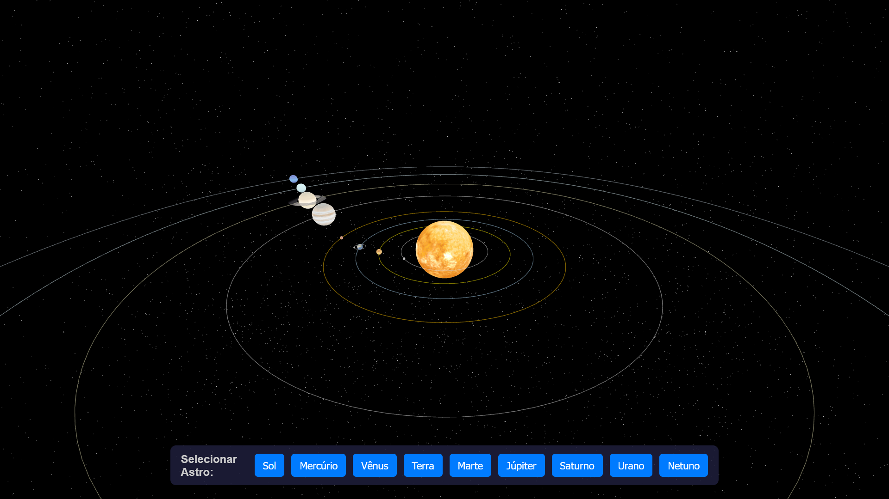
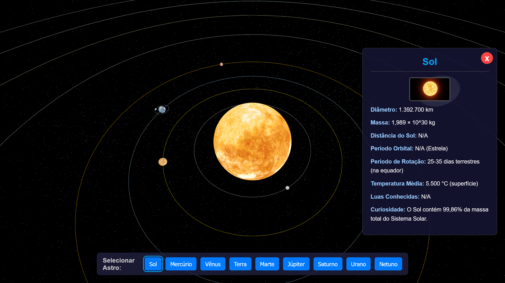

#  Sistema Solar

Um projeto de visualização 3D do Sistema Solar, desenvolvido com **Three.js**, que permite ao usuário explorar os planetas, suas órbitas e obter informações detalhadas sobre cada corpo celeste.

##  Descrição

Este projeto renderiza uma simulação interativa do nosso Sistema Solar em tempo real, diretamente no navegador. Utilizando a biblioteca **Three.js** para a criação de cenas 3D com WebGL, a aplicação exibe o Sol, os planetas e suas órbitas, com movimentos de rotação e translação. O usuário pode navegar livremente pelo espaço, focar em planetas específicos e clicar neles para abrir um painel com dados e curiosidades, como diâmetro, massa, período orbital e temperatura.

##  Demonstração em tempo real

*Sistema Solar em funcionamento*

##  Telas de Captura

*Screenshot 1*

*Screenshot 2*

##  Funcionalidades

-   **Visualização 3D Completa:** Todos os planetas do Sistema Solar, mais o Sol, renderizados com texturas realistas.
-   **Movimento Orbital e de Rotação:** Os planetas giram em torno de seus próprios eixos e orbitam o Sol em velocidades relativas.
-   **Navegação Interativa:** Controles de órbita (`OrbitControls`) que permitem ao usuário rotacionar a câmera, dar zoom e mover a cena livremente.
-   **Painel de Informações Dinâmico:** Ao clicar em um planeta ou no Sol, um painel lateral surge com informações detalhadas:
    -   Imagem do astro
    -   Diâmetro
    -   Massa
    -   Distância do Sol
    -   Período Orbital e de Rotação
    -   Temperatura Média
    -   Número de Luas
    -   Uma curiosidade
-   **Foco Automático:** Clicar em um astro ou selecioná-lo no menu faz a câmera se mover suavemente para focá-lo.
-   **Menu de Seleção Rápida:** Um menu na parte inferior da tela permite selecionar e focar diretamente em qualquer astro.
-   **Fundo Estrelado (Starfield):** Um campo de estrelas gerado proceduralmente para criar uma imersão maior no ambiente espacial.
-   **Design Responsivo:** A interface se adapta a diferentes tamanhos de tela.

##  Tecnologias Utilizadas

-   **Frontend:**
    -   HTML5
    -   CSS3
    -   JavaScript (ES6+)
-   **Biblioteca 3D:**
    -   Three.js - O motor principal para a renderização 3D via WebGL.
-   **Componentes do Three.js:**
    -   OrbitControls.js - Para a navegação interativa com o mouse.
-   **Animação:**
    -   Tween.js - Para criar as animações suaves de transição da câmera.

##  Como Executar o Projeto Localmente

Para executar este projeto em sua máquina, você precisará de um servidor local. Isso é necessário porque os navegadores modernos bloqueiam o carregamento de texturas (`file://`) por razões de segurança (política de CORS).

**Pré-requisitos:**
*   Um navegador web moderno (Chrome, Firefox, Edge).
*   Node.js (opcional, para usar `live-server`) ou Python (geralmente já vem instalado em Linux/macOS).

##  Autor

**Mateus S.**

-   GitHub: [@Matz-Turing](https://github.com/Matz-Turing)
